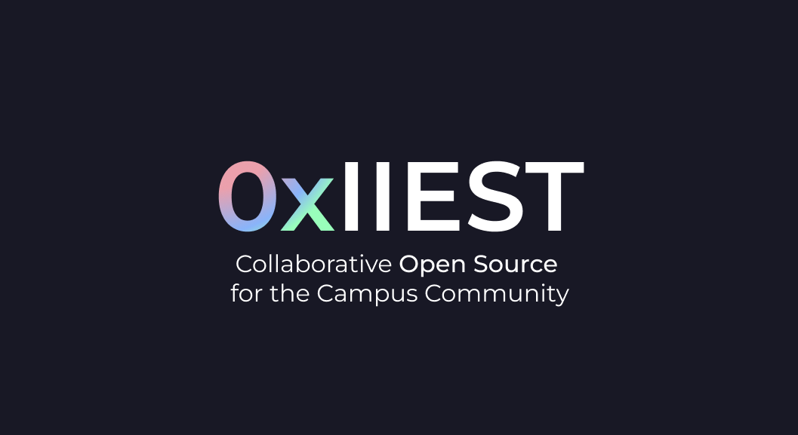

# 0xIIEST

## What?
This is an initiative to build and promote tools that solve problems within the **IIEST** college community, while also encouraging a culture of *Free and Open Source Software* (FOSS).

## How?

1. We maintain a student-run wiki with useful info about IIEST.
2. We host tools, scripts, and shortcuts to make student life easier.
3. We organize tech workshops and hack nights to help students learn and contribute to open source.
4. We keep a central place for student projects so good ideas are not forgotten.
